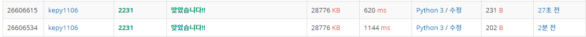

# 알고리즘 스터디 저장소


## 참고 사이트


### 1. SW Expert Academy

- [링크][https://swexpertacademy.com/main/main.do]


## SWEA - DP, DFS

### 4880 토너먼트 카드게임 & 4881 배열 최소 합

- 어떻게 접근해야 하는지 아직 많이 어색함
- DFS
  - 반복문
  - 재귀
    - 종료 조건


### 4869 - 종이붙이기

- 점화식을 찾아낸다는 개념 조차 생각하지 못했었다.
- 직접 그려봤더니 조금씩 이해가 되었다.

1. 가장 기본이 되는 조건을 찾아보기

   1. 너비가 10일 때,
   2. 너비가 20일 때

   **만들 수 있는 가장 작은 단위**

2. 길이가 n인 직사각형을 만들기 위해 어떻게 해야 하는가 파악하기


- 참고
  - [동빈나_다이나믹 프로그래밍 타일링 문제 풀어보기][https://www.youtube.com/watch?v=YHZiWaL49HY&t=114s&ab_channel=%EB%8F%99%EB%B9%88%EB%82%98]


## SWEA


### 1216 회문 2

내가 작성한 코드는 계산 시간이 너무 오래 걸린다.

코드의 작동 방식

1. 100x100 배열을 횡(row) 단위로 순환한다.

   1. 열(column) 단위로 순환

      1. 열 기준 탐색할 시작점(s)를 지정

      2. 열 기준 탐색할 종료지점(e)를 지정

         s=0 / e=99 ~ s=0 / e=1

         ​	종료지점은 점차 줄어들며 순환한다.

         s=98 / e=99

      3. 회문을 탐색할 문자열을 만든다.
      4. 문자열을 기준으로 회문인지 판단한다.


- 빠르게 하려면?
  1. 문자열을 만들고 회문을 판단하는 데 모두 반복문이 사용되고 있기 때문에, 중복되는 과정을 제거한다.


### 4861 파이프

- main.py 시간초과

  1. 파이프 개수를 세는 반복문을 파이프를 만들 때와 합치면 더 효율적이 될 수 있을 듯 함
     - 파이프의 시작점을 정하고, 파이프의 개수를 1로 초기화
     - 레이저를 만날 때 마다 1씩 개수를 추가
     - 파이프가 맞다면, 결과에 파이프의 개수를 더해준다.

- 해결

  - 너무 어렵게 생각한 것 같다

  - 괄호의 개수가 많기 때문에, 이중 반복문을 사용하지 않는 방법으로 생각하자.

  - 풀이 과정은 다음과 같다

    1. 괄호 문자열을 순환하여, 괄호가 열리고 닫힐 때 작업 수행
       1. 열린 괄호를 만난 경우

          1. 열린 괄호의 개수에 1 추가

             `current_pipe += 1`

       2. 닫힌 괄호를 만난 경우

          1. 열린 괄호 개수 1 감소

             `current_pipe -= 1`

          2. 이전 인덱스에 해당하는 괄호가 열린 괄호인 경우 == 레이저

             `if pipe[idx-1] == "("`

             1. 지금까지 열린 괄호의 개수만큼 파이프가 잘려나갔으니, 잘린 파이프 개수에 추가해준다

                `cut_pipe += current_pipe`

          3. 파이프 1개가 끝났으니, 잘린 파이프 개수에 1을 추가한다.

             `else: cut_pipe += 1`


### 4864 문자열비교

동일한 brute-force 방식이지만, 반복문 코드를 더 간결하게 짤 수 있다.

내 코드

```python
    for word in str2:
        # str1에 있는 문자와 일치한다면, 다음 문자를 찾고
        if word == str1[idx]:
            idx += 1
            # 모든 문자와 순서대로 일치한다면, 검색을 종료한다.
            if idx == len(str1):
                result = 1
                break
        # 일치하지 않는다면, 다시 첫 문자를 찾는다.
        else:
            idx = 0
            if word == str1[idx]:
                idx += 1
```

교수님 코드

```python
def brute_force1(p, t):
    for i in range(len(t)-len(p)+1):
        for j in range(len(p)):
            # t에서는 i만큼 shift되는 것
            if p[j] != t[i+j]:
                break
        else:
            return 1
    return 0
```


### 1979 어디에 단어가 들어갈 수 있을까

경계 조건을 설정하는 대신, 테두리에 0인 영역을 추가하여 문제를 해결할 수도 있다.

```python
for r in range(N):
    count = 0
    c = 0
    while c < N:
        if arr[r][c] == 0 or c == N-1:
            if count == M:
                result += 1
            count = 0
        else:
            count += 1
        c += 1
```

```python
arr = [list(map(int, input().split()))+[0] for _ in range(N)]		# 왼쪽 끝에 벽 추가
arr.append([0]*(N+1))												# 아래 끝에 벽 추가

for r in range(N):
    count = 0
    c = 0
    while c < N+1:
        if arr[r][c] == 0:
            if count == M:
                result += 1
            count = 0
        else:
            count += 1
        c += 1
```


## 백준

### 2798_블랙잭(브루트포스)

- 이진법을 활용한 부분집합 만들기는 요소의 개수가 정해져 있을 때 사용하기엔 적합하지 않을 수 있다.

  - 이진법을 활용한 부분집합 코드

    ```python
    for i in range(1 << n):
        sub_cards = []
        for j in range(n):
            if i & (1 << j):
                sub_cards.append(cards[j])
        if len(sub_cards) == 3:
            total = sum(sub_cards)
            if total == M:
                result = total
                break
            elif result < total <= M:
                result = total
    print(result)
    ```

  - 반복문과 인덱스를 활용한 부분집합 코드

    ```python
    is_done = False
    for a in range(n-2):
        for b in range(a+1, n-1):
            for c in range(b+1, n):
                total = cards[a] + cards[b] + cards[c]
                if total == M:
                    result = M
                    is_done = True
                    break
                if result < total < M:
                    result = total
            if is_done:
                break
        if is_done:
            break
    ```

### 2231_분해합(브루트포스)

- 최소 조건에 대해 고려해보는 것으로, 코드의 효율성을 높일 수 있다.

  ```python
  N = int(input())
  result = 0
  start_num = N // 2
  for i in range(start_num, N):
      num = i
      total = num
      while num:
          total += num % 10
          num //= 10
      if total == N:
          result = i
          break
  
  print(result)
  ```

  


## 풀이 현황


| 문제 번호 | 문제 이름                        | 접근법 | 난이도 | 풀이 날짜    | 사용 언어  |
| --------- | -------------------------------- | ------ | ------ | ------------ | ---------- |
| 1206      | [S/W 문제해결 기본] 1일차 - View |        | d3     | 21.02.08     | python     |
| 2063      | 중간값 찾기                      |        | d1     | 21.02.09     | python     |
| 1204      | 많이 나오는 수 찾기              |        | d2     | 21.02.09     | python     |
| 1945      | 소인수분해                       |        | d2     | 21.02.09     | python     |
| 4828      | 최소값, 최대값 구하기            |        | d2     | 21.02.09     | python     |
| 4834      | 숫자카드                         |        | d2     | 21.02.09     | python     |
| 4835      | 부분합 구하기                    |        | d2     | 21.02.09     | python     |
| 1206      | View                             |        | d3     | 21.02.09     | python     |
| 1208      | 평탄화                           |        | d3     | 21.02.09     | python     |
| 4831      | 전기 버스                        |        | d3     | 21.02.09     | python     |
| 5789      | 박스 이름 바꾸기                 |        | d3     | 21.02.09     | python     |
| 1284      | 수도요금 경쟁                    |        | d2     | 21.02.10     | python     |
| 1288      | 새로운 불면증 치료법             |        | d2     | 21.02.10     | python     |
| 1959      | 두 개의 숫자열                   |        | d2     | 21.02.10     | python     |
| 6485      | 삼성시의 버스노선                |        | d3     | 21.02.10     | python     |
| 1209      | sum (100x100 2차원 배열)         |        | d3     | 21.02.15     | python     |
| 1210      | Ladder1 (사다리게임)             |        | d4     | 21.02.15     | python     |
| 1210      | Ladder1 (사다리게임 - main2)     |        | d4     | 21.02.16     | python     |
| 2001      | 파리 퇴치                        |        | d2     | 21.02.16     | python     |
| 4836      | 색칠하기                         |        | d2     | 21.02.16     | python     |
| 4839      | 이진탐색                         |        | d2     | 21.02.16     | python     |
| 1244      | 최대 상금                        |        | d3     | 21.02.16     | python     |
| 4837      | 부분집합의 합                    |        | d3     | 21.02.16     | python     |
| 4843      | 특별한 정렬 (main, main2)        |        | d3     | 21.02.16     | python     |
| **1245**  | **균형점 (어려움)**              |        | **d5** | **21.02.16** | **python** |
| 4861      | 회문                             |        | d2     | 21.02.18     | python     |
| 4865      | 글자수                           |        | d2     | 21.02.18     | python     |
| 1216      | 회문2                            |        | d3     | 21.02.18     | python     |
| 5432      | 쇠막대기 자르기 (어려움)         |        | d4     | 21.02.18     | python     |
| 2005      | 파스칼의 삼각형                  |        | d2     | 21.02.23     | python     |
| 4866      | 괄호검사                         |        | d2     | 21.02.23     | python     |
| 4869      | 종이붙이기 (어려움)              |        | d2     | 21.02.23     | python     |
| 4871      | 그래프 경로                      |        | d2     | 21.02.23     | python     |
| 4873      | 반복문자 지우기                  |        | d2     | 21.02.23     | python     |
| 1217      | 거듭제곱                         |        | d4     | 21.02.23     | python     |
| 1218      | 괄호 짝짓기                      |        | d4     | 21.02.23     | python     |
| 1219      | 길찾기                           |        | d4     | 21.02.23     | python     |
| 4874      | Forth                            | stack  | d2     | 21.03.02     | python     |
| 4875      | 미로                             | dfs    | d2     | 21.03.02     | python     |
| 4880      | 토너먼트 카드게임 (어려움)       | dfs    | d2     | 21.03.02     | python     |
| 4881      | 배열 최소 합 (어려움)            | dfs    | d2     | 21.03.02     | python     |
| 1224      | 계산기3                          | stack  | d4     | 21.03.02     | python     |
| 1226      | 미로1                            | dfs    | d4     | 21.03.02     | python     |
|           |                                  |        |        |              |            |
|           |                                  |        |        |              |            |
|           |                                  |        |        |              |            |